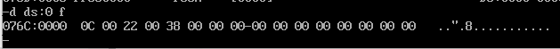
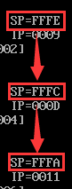
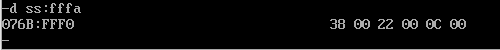
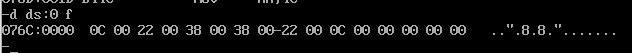

```asm
;示例4-1
;设计程序，利用堆栈，将存储单元中
;的三个数倒序存放
; 	   ___
; 	  |___|<-低地址
; 	  |___|
; 	  |___|  ↑push      出栈方向
;     sp->|_x_|   进栈方向  ↓pop
; 	  |_y_|<-高地址
; 每次地址变化都是两位
; 需要用双字节


data segment
	x dw 12,34,56
	y dw 3 dup(?)
data ends

code segment
	assume cs:code,ds:data
start:
	mov ax,data
	mov ds,ax 
	push x
	push x+2
	push x+4
	pop y 
	pop y+2
	pop y+4
	mov ah,4ch
	int 21h

code ends
end start
```
+ 查看初始数据存储：



+ 然后当我们调用push三次后，sp指针变化由高到低：  


+ 三次push后，ss栈中存储的数据（<font color = red>**注意那个偏移地址！**</font>）：



+ 调用pop之后，查看数据段中的结果


