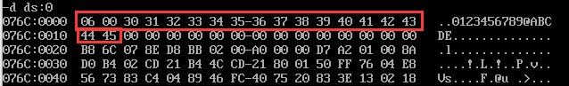
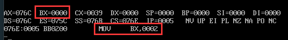
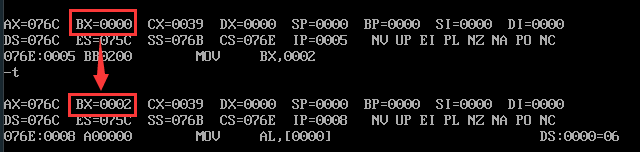
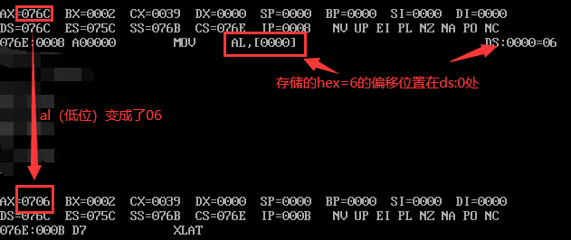
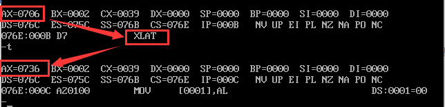

```asm
; 查表指令XLAT
; AL <-- ((BX) + (AL))
; BX -> 数据表的首地址
; AL -> 查找单元的位移量

; 示例4-2 
; 用查表指令将一位十六进制数转换为它对应的ASCII码
; 并且显示出该数

data segment
	hex db 6;要查找6
	asc db ?;开辟一个字节的空间，用于存储6的ascii码
	table db 30h,31h,32h,33h,34h,35h,36h,37h
		  db 38h,39h,40h,41h,42h,43h,44h,45h
	
data ends

code segment
assume ds:data,cs:code
start:
	mov ax,data
	mov ds,ax 
	mov bx,offset table
	mov al,hex

	xlat;换码指令，从table6号单元取数存入al

	mov asc,al
	mov dl,al;要显示的ascii码放入dl
	mov ah,2
	int 21h

	mov ah,4ch
	int 21h

code ends
end start
```

+ 初始数据



+ 表头给bx  `mov bx,offset table`





+ 偏移地址给al



+ 执行xlat



最后就是调用2号功能进行展示就行了。🆗