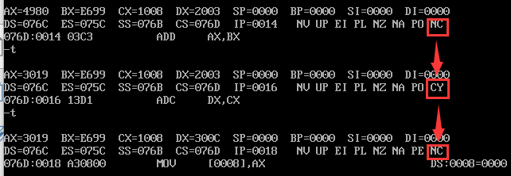

## 4.4
编写程序实现两个双精度数20034980H和1008E699H加方法运算

思路：  
当我们看到这么长的数字，存储数据时就得分开存储，
```asm
data segment
	;第一个数 20034980h
	d1_2 dw 4980h
	d1_1 dw 2003h
	;第二个数 1008e699h
	d2_2 dw 0e699h
	d2_1 dw 1008h
	d3_2 dw ?
	d3_1 dw ?
data ends

code segment
assume ds:data,cs:code
start:
	mov ax,data
	mov ds,ax 
	mov ax,d1_2;第一个数低位
	mov dx,d1_1;第一个数高位
	mov bx,d2_2;第二个数低位
	mov cx,d2_1;第二个数高位
	add ax,bx
	adc dx,cx;adc 在相加的同时加上上个add的进位
	mov d3_2,ax 
	mov d3_1,dx
	mov ah,4ch
	int 21h
code ends
end start
```
我们定义d1_1位第一个数的高位，d1_2为第一个数的低位，d2_1为第二个数的高位，d2_2为第二个数的低位，d3_1为第三个数的高位，d3_2为第三个数的低位。

那么我们选择用四个寄存器来存储这几个数  
用ax存储第一个数的低位  
用dx存储第一个数的高位  
用bx存储第二个数的低位  
用cx存储第二个数的高位  
那么，对于ax+bx我们使用正常的`add`,但是我们要考虑到ax+bx会产生进位，汇编中，进位标志是**CF**，溢出标志是**OF**，还有一个辅助进位标志**AF** 这个以后再谈。


如图我们可以看到，执行了ax+bx后进位标志从NC变成了CY，表示产生了进位，那么dx和cx两个高位在相加时就要考虑这个进位，所以就有了`adc`指令，我们看到，执行了adc指令后，进位标志重新变成了NC，如果只是`add dx,cx`，dx最终存储的结果应该是300B，然而现在却变成了300C，说明我们把进位给加上了。  

然后就按部就班地把高位和低位的值都付给相应的第三个数的高低位就行了

## 4.5
对于两个双精度数相减，我们也可以知道，如果两个低位相减需要从高位借一位，高位相减时就应该考虑到这一点，`sbb`指令，就是考虑到低位相减的借位情况
```asm
data segment
	x db 34h,0dh,22h
	y db 4ch,58h,14h
	z db ?,?,?
data ends

code segment
assume ds:data,cs:code
start:
	mov ax,data
	mov ds,ax
	mov al,x[0]
	sub al,y[0]
	mov ah,x[1]
	sbb ah,y[1]
	mov dl,x[2]
	sbb dl,y[2]
	mov z[0],al
	mov z[1],ah
	mov z[2],dl
	mov ah,4ch
	int 21h
code ends
end start
```