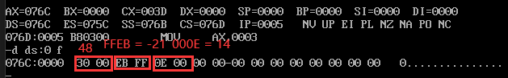
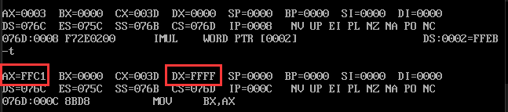
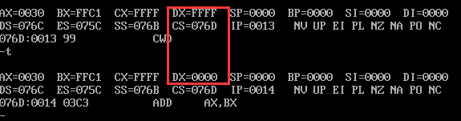

## 4.6
对公式（x+y*3-45)/3进行运算。商放入变量w内，余数放入w+2内
```asm
;(x+3*y-45)/z
data segment
	x dw 48
	y dw -21
	z dw 14
	w dw ?,?
data ends
code segment
assume ds:data,cs:code
start:
	mov ax,data
	mov ds,ax
	mov ax,3
	imul y ;带符号位乘法，低位放入ax，高位放入dx
	mov bx,ax
	mov cx,dx
	mov ax,x
	cwd ax
	add ax,bx
	adc dx,cx
	sub ax,45;低位减去45
	sbb dx,0;ax减去45，考虑是否需要借位
	
	idiv z;商存入ax，余数存入dx
	mov w,ax
	mov w+2,dx
	
	mov ah,4ch
	int 21h
code ends
end start

```
### 初始数据(负数也都是以补码的形式存储的)


### 执行乘法
我们发现，乘法中y=-21是有符号的，所以我们需要使用`imul`来进行有符号的乘法计算，由于我们定义的y是字单元，所以最终的结果，高位存入dx，低位存入ax，我们来看看执行效果


AX = FFC1 = 1111 1111 1100 0001(补码)   
减一取反获得原数  1000 0000 0011 1111 = **-** 63

DX = FFFF 说明高位为零，没有进位
由于我们一会的除法要用到ax和dx，所以我们用bx和cx来存储乘法的结果
然后将x移入ax进行x + 3*y中的加法

### cwd
执行cwd，对ax进行拓展，使其和dx共同表示一个数

然后再执行`add`和`acd`,`acd`是考虑到ax+bx可能会有进位，高位相加时需要考虑CF进位标志，所以使用acd

### 执行减法，除法，最后将结果存入w中。