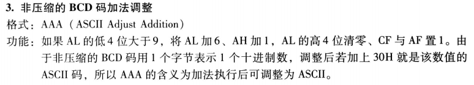
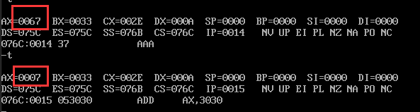
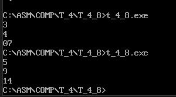

```asm
;示例4_8 用简化的程序格式从键盘输入两个一位的十进制数，做加法运算。
;相加后以蓝底黄字显示到屏幕上

;1.显示：1号功能
;2.非压缩BCD码加法调整指令AAA会将AL的高四位清零
;因此键盘输入的数字不必去掉30h，可直接运算
;3.用BIOS中断调用INT 10H的3号功能获得光标位置
;让结果显示到光标处
;4.由于计算结果不会超过两位十进制，可使用SI寄存器
;保存十进制数的ASCII码。
data segment
data ends
code segment
	assume cs:code,ds:data
	start:
	
	mov ah,1
	int 21h
	
	mov bl,al;输入的数进入al，用bl保存al
	mov ah,2
	mov dl,0ah;使用换行功能
	int 21h
	mov ah,1
	int 21h
	add al,bl;加在一起
	mov ah,0;ah=1，由于al和bl相加的结果可能大于9，要往ah进位，所以先将ah置零
	aaa;如果有进位，直接进到ah里面，
	add ax,3030h;ah是十位数的ascii码，al是个位数的ascii码
	mov bh,ah
	mov bl,al
	mov ah,2
	mov dl,0ah;输出结果的时候换行
	int 21h
	mov dl,bh
	int 21h
	mov dl,bl
	int 21h
	
	
	mov ah,4ch
	int 21h
code ends
	end start
```
## 关键点：
注意这句话
>2.非压缩BCD码加法调整指令AAA会将AL的高四位清零
;因此键盘输入的数字不必去掉30h，可直接运算

我们来回想一下书上对于`AAA`非压缩BCD码加法的定义是怎样的：


 
这里只讨论了当AL的低4位大于9的时候，AAA会进行怎样的操作，那小于9呢？  

结合本题，如果是`3+4`这样的两个数据相加，我们看到自己输入的是3和4，但对于计算机来说，你输入的却是ascii码十六进制下的33h和34h，那么这种情况下，我们实际执行的加法就变成了`33h + 34h`，结果等于`67h`,这也al的低4位也没大于9啊，执行AAA还有作用吗？
其实书上没说错，只不过是说的少了一些。完整版的如下:
>如果al的低4位是在0到9之间，保留低4位，清除高4位，如果al的低4位在10到15之间，则通过加6，来使得低4位在0到9之间，然后再对高4位清零。
如果al的低4位是在0到9之间，ah值不变，CF和AF标志清零，否则，ah=ah+1，并设置CF和AF标志。

那么我们来验证一下

确实，当al的低4位在0到9之间时，al的高4位被清零了，所以我们直接获得输入就可以了，没必要将输入的ascii码减去30h换成正常数字。

## 结果

