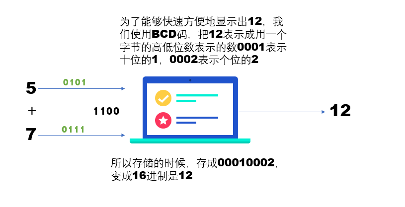
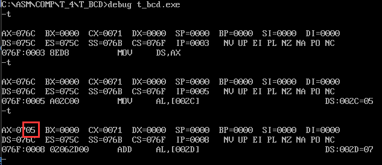
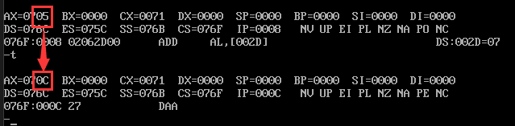
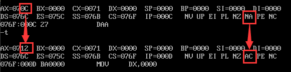

# BCD码

## 压缩BCD码
```asm
;测试压缩BCD码
data segment
	info db 'press bcd+ answer:$'
	info2 db 0ah,0dh,'press bcd- answer:bye!$'
	press_a db 05H
	press_b db 07H
	press_c db 62H
	press_d db 38H
data ends

code segment
assume ds:data,cs:code
start:
	mov ax,data
	mov ds,ax
	mov al,press_a
	add al,press_b
	daa
	mov dx,offset info
	mov ah,9h
	int 21h
	add al,30h
	mov dl,al
	mov ah,2
	int 21h
	
	
	mov dx,offset info2
	mov ah,09h
	int 21h
	mov al,press_c
	sub al,press_d
	das
	;输出不出来，11点了，我不玩了，淦
	;mov ah,0
	;mov bl,8
	;div bl
	;add ax,3030h
	;mov dl,al
	;mov ah,2
	;int 21h
	;mov dl,ah
	;mov ah,2
	;int 21h
	
	;mov ah,0
	;AAA
	;add ax,3030h
	;mov bx,ax
	;mov dl,bl
	;mov ah,2
	;int 21h
	;mov dl,bh
	;int 21h
	
	mov ah,4ch
	int 21h
	
	
code ends
end start
```


### 压缩BCD码加法调整 DAA（decimal adjust addition)

#### 前言

*首先要注意一点，比如我们想计算5+7,我们首先要把 5 和 7 转换成压缩bcd码，你看我在数据段定义的数据，是 5h 和 7h，好像不太明显，那么如果我们举个例子：*  
23 + 48 = 71
对这个例子，先转换为BCD码：
```  
  0010 0011 （23）  
 +0100 1000 （48）  
 --------------------   
  0110 1011 （≠71）

可以看到1011已经属于不合法的BCD码表示。
```
*我们在数据段定义这俩的数据的时候，用的是23h和48h，而不是十进制23和48*

#### 为啥使用压缩BCD码

为啥使用BCD码？就拿书上的例子，




#### 实例执行

我们看上面的代码 `press_a + press_b`,

将 press_a 送入 ax 的 al 寄存器，



然后执行加法



这时候我们发现al已经变成0c了，al的低四位为c（十进制的12）大于等于9，那么对al加6，任何大于9的数加上6一定会进位到al的高四位，这么就达到了十进制类似的超9进位的效果


此时应该注意上图的NA->AC的转变  

**debug中的标志位显示顺序：OF DF IF SF ZF AF PF CF**  

我们通过对比发现这个位置为AF，半进位标志从NA变成AC，也就是说AF变成了1。  

如果是70+50，二进制加法就是`70h + 50h =  01110000 + 00110000`，结果是`11000000`, 高四位大于9，那么此时al就要加上60h, 加上后结果al变成了`00100000(20h)`，但此时CF变成1，连起来也是120

压缩BCD码的精髓就是让每四位都只表达一个单个的数，超过九就往前进。

---

### 压缩BCD码减法调整(DAS：decimal adjust substraction)
#### 原理
+ 压缩BCD码的减法，首先要保证被减数和减数都是BCD格式的数
+ 如果辅助进位标志AF为1，则说明个位数上的减法需要借1，此时本着按照十进制加法进行的思想，正常情况下借的位是16，为了让借的位变成10，则需要al减去6，比如 `64h-58h`，正常情况下，按照16进制减法，`4-8` 不够则需要向ah借1，那么就相当于 `4 + 16 - 8`，当然，**这样很不十进制**，为了换成十进制的风格，变成 `4 + 10 - 8 = 6` 的效果，我们就让结果减去6。
一句话，就是 AF=1，al - 6，同时保持AF等于1，因为十位上进行减法，还需要AF来判断个位是否从自己这里借没借1，从而决定ah操作完后还要不要减去1
+ 